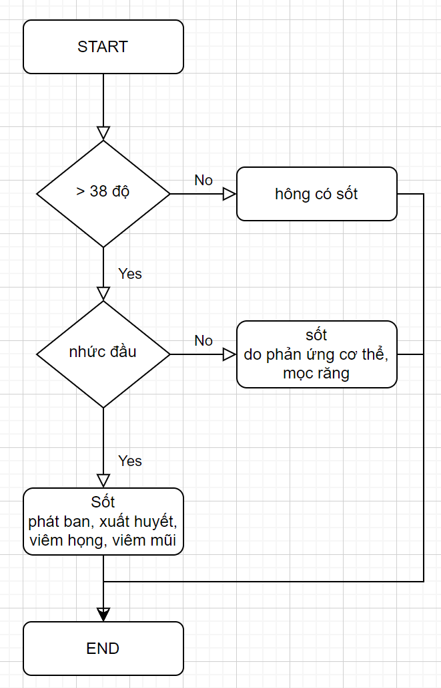

# Lưu đồ điều khiển



## Cấu trúc lệnh IF ELSE

Cấu trúc lệnh
```python
if [điều kiện]:
    print()
else:
    print()
```

vidu
```python
if 3 > 0:
    print("đúng")

a = 6
if a % 2 == 0:
    print("đúng")
else
    print("sai")

if 2 == 2:
    print("aaa")
```

### Bài tập

1. Kiểm tra chẳn lẻ
    - nhập 1 số
    - kiểm tra số đó là số chẳn hay lẻ
2. Khu vui chơi TiniWorld
    - viết chương trình kiểm tra chiều cao khi vào khu vui chơi TiniWorld
    - nếu chiều cao dươi 1m thì không được vào
    - nếu trên 1m thì được vào

## Cấu trúc IF trong IF

```python
if [điều kiện 1]:
    if [điều kiện 2]:
        print()
    else:
        print()
else:
    print()
```

## Cấu trúc IF ELIF

```python
if [điều kiện 1]:
    print()
elif [điều kiện 2]:
    print()
else:
    print()
```

### Bài tập

3. Kiểm tra bạn có bị sốt không
    - nhiệt độ cơ thể > 38 độ
    - nhức đầu

4. Đánh giá học sinh
    - điểm trung bình
    - ĐTB < 5 - HS trung bình
    - 5 < ĐTB < 7 - HS khá
    - 7 < ĐTB < 9 - HS giỏi
    - ĐTB > 9 - HS xuất sắc

5. Tính năm nhuận
    - cách tính
    - năm chia 4 ---> số chẳn
    - năm chia 100 ---> số chẳn
    - năm chia 400 ---> số chẳn

6. Giảm giá cho trẻ em
    - < 12t - giảm 10%
    - ngày sinh nhật - giảm thêm 10%

7. Đặt bánh pizza
    - nhập kích thước (S: 15d, M: 20d, L: 25d)
    - sốt tiêu đen? Y or N (+2d)
    - thêm phô mai? Y or N (S: +3d, M: +6d, L: +10d)
    - xuất ra tiền phải trả

## Cấu trúc IF với nhiều điều kiện

```python
if [điều kiện 1] & [điều kiện 2] & [điều kiện 3]:
    print()
```

```python
if [điều kiện 1] & [điều kiện 2]:
    print()
else
    print()
```

## Hàm lower(), upper(), count()

```python
lowName = "KienVan".lower()
print(lowName)
```

```python
upName = "KienVan".upper()
print(upName)
```

```python
Name = "GIA Man"
Name.count("a")
lowName = name.lower()
lowName.count("a")
```

### Bài tập

8. Dự đoán tương lai làm:
    - Nhập họ và tên của bạn
    - Các nghề:
        - Tiktoker
        - Youtuber
        - Bác Sĩ
    - Cách tính
        - VD [Youtuber]
        - chữ y xuất hiện bao nhiêu lần trong tên của bạn
        - chữ o xuất hiện bao nhiêu lần trong tên của bạn
        - chữ u xuất hiện bao nhiêu lần trong tên của bạn
        - chữ t xuất hiện bao nhiêu lần trong tên của bạn
        - chữ b xuất hiện bao nhiêu lần trong tên của bạn
        - chữ e xuất hiện bao nhiêu lần trong tên của bạn
        - chữ r xuất hiện bao nhiêu lần trong tên của bạn
        - tính ra phần trăm
    - Xuất ra phần trăm sẽ làm nghề đó

9. Làm bài đảo kho báu

